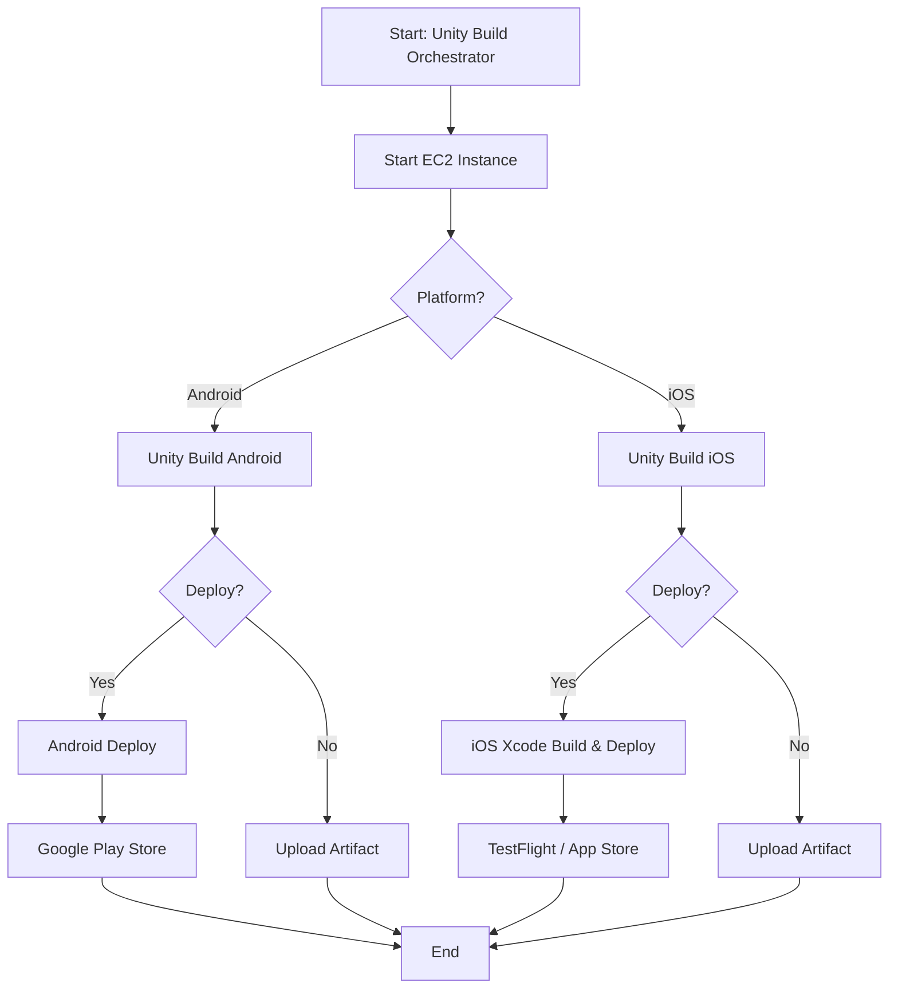

# DevOps Portfolio

[](https://opensource.org/licenses/MIT)
[](https://github.com/features/actions)
[](https://fastlane.tools/)
[](https://unity.com/)

Коллекция production-ready GitHub Actions (reusable workflows и composite actions) для CI/CD мобильных приложений на Unity.

## 📋 Описание

Набор переиспользуемых GitHub Actions workflows и composite actions для автоматизации сборки и деплоя мобильных приложений на Unity (Android и iOS).

## 🚀 Основные возможности

- Автоматическая сборка Unity проектов для Android и iOS
- Управление версиями на основе git tags
- Деплой в Google Play Store и App Store / TestFlight
- Локальное кэширование Unity Library для ускорения сборок
- Управление сертификатами через Fastlane Match
- Обработка debug symbols (dSYM, mapping)

## ⚙️ Сервисы

### GitHub Runner Lifecycle Management

Универсальная система для автоматического управления жизненным циклом self-hosted GitHub Actions runners. Работает на любом Linux-сервере или в облаке (AWS EC2), мониторит активность runner'ов и автоматически останавливает простаивающие инстансы для оптимизации расходов.

➡️ **[Подробная документация](./services/github-runner-lifecycle/README.md)**

## 🏗️ Структура репозитория

```
devops-portfolio/
├── .github/
│   ├── actions/              # Composite actions
│   └── workflows/            # Reusable workflows
├── docker/                   # Docker-конфигурации для сред
├── docs/                     # Документация по workflows и actions
├── fastlane/                 # Fastlane конфигурация
├── services/                 # Вспомогательные сервисы
│   └── github-runner-lifecycle/ # Управление жизненным циклом self-hosted runners
├── README.md
├── LICENSE
└── .gitignore
```

## 📂 Архитектура пайплайна

### Основная последовательность
1. **Unity Build Orchestrator** (`.github/workflows/unity-build-orchestrator.yml`) — точка входа. Запускает self-hosted раннер, распределяет задачи между платформенными workflow и управляет последовательностью сборка→деплой.
2. **Reusable Unity Build** (`.github/workflows/reusable-unity-build.yml`) — выполняется отдельно для Android и iOS: собирает проект на Unity, управляет кэшем, рассчитывает версии и выгружает артефакты.
3. **Android Deploy** (`.github/workflows/android-deploy.yml`) — подключается, когда выбран сценарий с деплоем Android. Забирает артефакт сборки, готовит Fastlane окружение и публикует AAB в Google Play (internal/beta) с нужным статусом релиза.
4. **iOS Xcode Build & Deploy** (`.github/workflows/ios-xcode-build.yml`) — обрабатывает экспортированный Unity-проект на macOS runner: устанавливает зависимости, выполняет Fastlane `ios build`/`ios beta`, выгружает IPA, dSYM и логи.
5. **Android IAS** (`.github/workflows/android-ias.yml`) — вызывается из оркестратора, если выбран вариант с Internal App Sharing. Использует composite action `upload-internal-sharing` для генерации прямой ссылки.

### Поддерживающие компоненты
- `.github/actions/*` — вспомогательные действия для checkout, проверки секретов, настройки проекта, расчёта версий, кэширования Unity Library и загрузки артефактов. Полный список и описания параметров: [`docs/actions/README.md`](./docs/actions/README.md).
- `.github/workflows/manage-ec2.yml` — отвечает за старт/стоп self-hosted раннера перед сборкой Unity.
- `fastlane/Fastfile` — содержит lanes, которые вызываются из workflows для публикации в магазины и генерации changelog.

### Поток данных
1. Запускаем оркестратор → получаем параметры запуска → логируем их в `show-run-info`.
2. Через `start-instance` активируется EC2 раннер. После этого для каждой платформы `reusable-unity-build`:
   - Подтягивает код основной игры, подготавливает проект Unity (Define Symbols, Project Settings).
   - Получает версии из git и магазинов через Fastlane actions.
   - Запускает `game-ci/unity-builder`, сохраняет артефакты и формирует step summary.
3. После успешной сборки подключаются деплойные workflows (Android Deploy / iOS Xcode Build) — скачивают артефакты, настраивают Fastlane и выполняют загрузку в магазины.
4. Финальные шаги собирают информацию о релизе и генерируют ссылки (Internal App Sharing, IPA/dSYM, step summary).

## 🔐 Требуемые секреты и переменные

### Общие секреты

- `UNITY_EMAIL` - Email для Unity аккаунта
- `UNITY_PASSWORD` - Пароль Unity аккаунта
- `UNITY_SERIAL` - Unity лицензионный ключ

### Android секреты

- `ANDROID_PACKAGE_NAME` - Package name приложения
- `GOOGLE_PLAY_KEY_FILE` - JSON ключ для Google Play API
- `ANDROID_KEYSTORE_BASE64` - Keystore файл в base64
- `ANDROID_KEYSTORE_PASS` - Пароль keystore
- `ANDROID_KEYALIAS_NAME` - Alias ключа
- `ANDROID_KEYALIAS_PASS` - Пароль alias

### iOS секреты

- `IOS_BUNDLE_ID` - Bundle ID приложения
- `APPLE_DEVELOPER_EMAIL` - Email Apple Developer аккаунта
- `APPLE_CONNECT_EMAIL` - Email для App Store Connect
- `APPLE_TEAM_ID` - Apple Team ID
- `APPSTORE_KEY_ID` - App Store Connect API Key ID
- `APPSTORE_ISSUER_ID` - App Store Connect API Issuer ID
- `APPSTORE_P8` - Содержимое .p8 файла
- `MATCH_REPOSITORY` - Репозиторий для Fastlane Match (формат: org/repo)
- `MATCH_DEPLOY_KEY` - SSH ключ для доступа к Match репозиторию
- `MATCH_PASSWORD` - Пароль для Match репозитория

### Переменные окружения

- `RUNNER_USERNAME` - Имя пользователя на self-hosted runner
- `UNITY_CACHE_MAX_COUNT` - Максимальное количество кэшей
- `UNITY_CACHE_MAX_AGE_DAYS` - Максимальный возраст кэша в днях
- `IOS_EXTERNAL_GROUP_NAME` - Название группы внешних тестеров

## 📚 Документация

### Workflows

- [Unity Build Orchestrator](./docs/workflows/unity-build-orchestrator.md) - Центральный workflow-оркестратор сборки и деплоя
- [Reusable Unity Build](./docs/workflows/reusable-unity-build.md) - Переиспользуемый workflow сборки
- [Android Deploy](./docs/workflows/android-deploy.md) - Деплой в Google Play Store
- [iOS Xcode Build](./docs/workflows/ios-xcode-build.md) - Сборка и деплой iOS приложений

### Composite Actions

- Полный перечень с параметрами: [`docs/actions/README.md`](./docs/actions/README.md)
- Ключевые модули:
  - `checkout-project` — checkout с Git LFS и резервным копированием служебных директорий.
  - `download-build-artifact` — скачивание артефактов с fallback-логикой.
  - `platform-*` — подготовка окружения/настроек (secrets, project settings, post-build, версии и т.д.).
  - `unity-cache` — локальный кэш Unity Library.
  - `upload-internal-sharing` — публикация AAB в Google Play IAS.

### Fastlane

- [Fastlane Documentation](./fastlane/README.md) - Документация по Fastlane lanes

## 🔄 Pipeline диаграмма



## 📝 Лицензия

Этот проект лицензирован под MIT License - см. [LICENSE](./LICENSE) для деталей.

